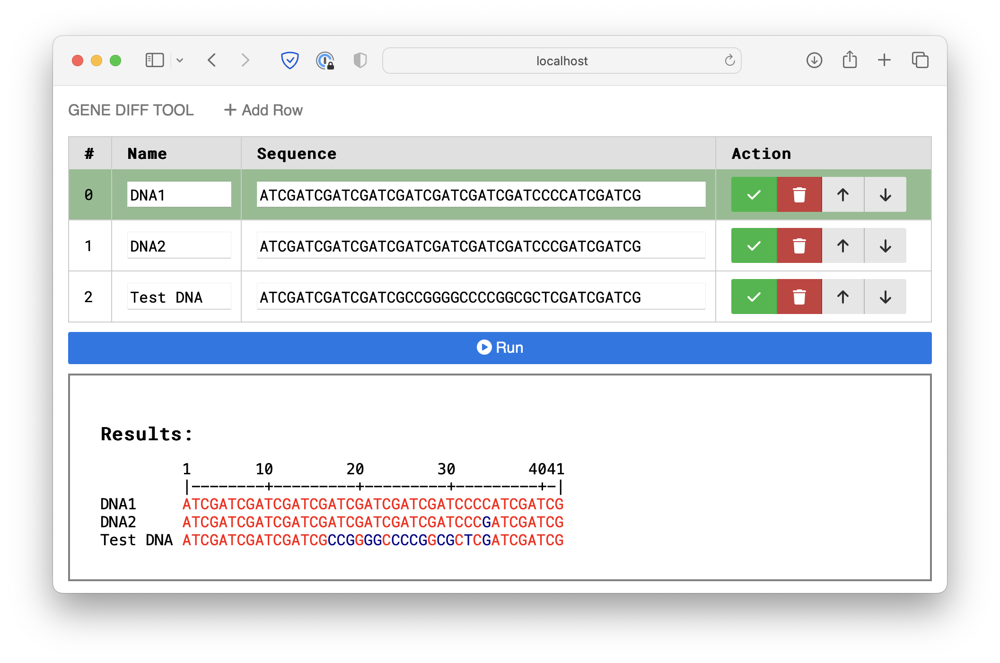

## Gene Diff Tool
This is a tool to show the differences among mutiple DNA/RNA sequences.

Demo: [https://gene-diff.pages.dev](https://gene-diff.pages.dev)
## Demo

## Techstack
Vue 3 +  TypeScript + Vite

## Development
```bash
nvm install 18 # Swicth to use Nodejs 18
npm install
npm run dev
```

## Production
```bash
nvm install 18 # Swicth to use Nodejs 18
npm install
npm run build
cd dist/ && ls
```

## License
The MIT License (MIT).
Detailed license can be found [here](./LICENSE).